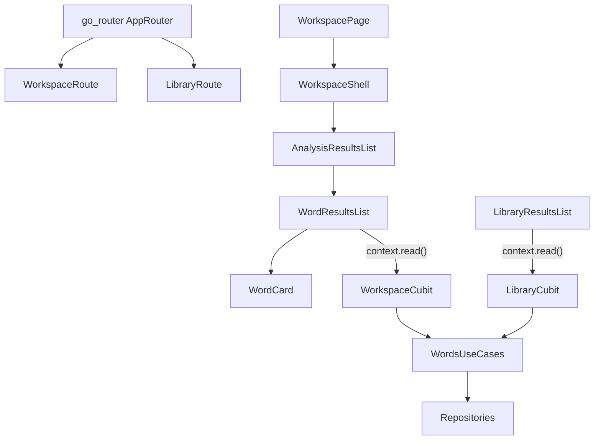

# WordFlow Refactor Plan

## Scope And Assumptions

- Source of truth: existing `wordflow-performance` direction + your 5 new constraints.
- Navigation target: `go_router`.
- Widget-to-Cubit interaction standard: leaf widgets use `context.read<Cubit>()` instead of callback chains.

## Current Hotspots To Refactor

- **Callback prop-drilling chain** from page -> body -> section -> list -> card in workspace flow: [lib/features/words/presentation/pages/workspace_page.dart](lib/features/words/presentation/pages/workspace_page.dart), [lib/features/words/presentation/widgets/workspace_body.dart](lib/features/words/presentation/widgets/workspace_body.dart), [lib/features/words/presentation/widgets/results_section.dart](lib/features/words/presentation/widgets/results_section.dart), [lib/features/words/presentation/widgets/analysis_results_list.dart](lib/features/words/presentation/widgets/analysis_results_list.dart), [lib/features/words/presentation/widgets/word_results_list.dart](lib/features/words/presentation/widgets/word_results_list.dart), [lib/core/widgets/word_card.dart](lib/core/widgets/word_card.dart).
- **Scattered imperative navigation** (`Navigator.of(context)` / `Navigator.push`): [lib/features/words/presentation/widgets/workspace_header.dart](lib/features/words/presentation/widgets/workspace_header.dart), [lib/features/words/presentation/pages/library_page.dart](lib/features/words/presentation/pages/library_page.dart), [lib/features/words/presentation/widgets/add_edit_word_sheet.dart](lib/features/words/presentation/widgets/add_edit_word_sheet.dart), [lib/features/auth/presentation/widgets/auth_form.dart](lib/features/auth/presentation/widgets/auth_form.dart), [lib/features/auth/presentation/widgets/merge_conflict_dialog.dart](lib/features/auth/presentation/widgets/merge_conflict_dialog.dart).
- **Nested UI composition and duplicated UI/logic**: [lib/features/words/presentation/widgets/workspace_body.dart](lib/features/words/presentation/widgets/workspace_body.dart), [lib/features/words/presentation/pages/library_page.dart](lib/features/words/presentation/pages/library_page.dart), [lib/features/words/presentation/widgets/word_library_card.dart](lib/features/words/presentation/widgets/word_library_card.dart), [lib/core/widgets/word_card.dart](lib/core/widgets/word_card.dart), [lib/features/words/presentation/cubit/library_cubit.dart](lib/features/words/presentation/cubit/library_cubit.dart).

## Target Architecture

## Implementation Workstreams

### 1) Deep Best-Practice Baseline (Clean Code / Clean Arch / flutter_bloc / Dart)

- Define project-specific standards doc in `docs_dev/` for:
  - max widget responsibilities, callback policy, naming, file-size targets, duplication thresholds.
  - bloc interaction rules (`context.select`, `BlocSelector`, side-effects via listeners only).
  - clean-architecture boundaries (presentation no data-layer knowledge).
- Use this standards doc as acceptance criteria for all refactor phases.

### 2) Replace Callback Chains With Cubit Access In Leaf Widgets

- Remove upward callback plumbing for workspace actions.
- Convert leaf interactions to direct cubit method calls:
  - `WordCard` toggle action handled in list/container where cubit is available.
  - analyze/clear actions triggered from local feature widget with `context.read<WorkspaceCubit>()`.
- Keep immutable input props for render-only values; move command props out unless truly reusable.

### 3) Flatten Widget Trees And Split By Responsibility

- Refactor large build methods into flatter feature slices:
  - workspace: shell/layout, controls, results, listeners separated by intent.
  - library: page shell vs list-state presenter vs dialogs/bottom-sheet launcher.
- Prefer early-return + section widgets over deeply nested inline composition.
- Use `const` and `BlocSelector` to reduce rebuild surfaces.

### 4) Introduce App Navigation Layer With go_router

- Add router setup (`AppRouter`) and route declarations for workspace/library/auth flows.
- Replace direct `Navigator.*` calls with router navigation APIs.
- Centralize dialog/sheet close behavior through route-aware helpers where needed.
- Keep existing UX unchanged while swapping implementation.

### 5) Remove Duplications

- Consolidate duplicated word-card presentation primitives (`WordCard` + `WordLibraryCard`) into shared composable parts.
- Extract repeated state transition logic in `LibraryCubit` optimistic flows into reusable private helpers or operation wrappers.
- Reduce repeated section scaffolding in results-state widgets.

### 6) Validation, Safety, And Incremental Delivery

- After each phase: run `flutter analyze`, widget tests, and targeted interaction checks.
- Add tests for:
  - optimistic toggle/add/delete rollback behavior.
  - route navigation (workspace <-> library).
  - list animation behavior and state transitions.
- Roll out in small PR-sized checkpoints to minimize regression risk.

## Refactor Sequence (Low Risk Order)

1. Best-practice baseline doc and acceptance checklist.
2. Callback-chain removal in workspace results flow.
3. Tree flattening in workspace/library presentation.
4. go_router introduction and navigation migration.
5. Duplication cleanup in cards and cubit logic.
6. Final pass with lint/tests and performance sanity checks.

